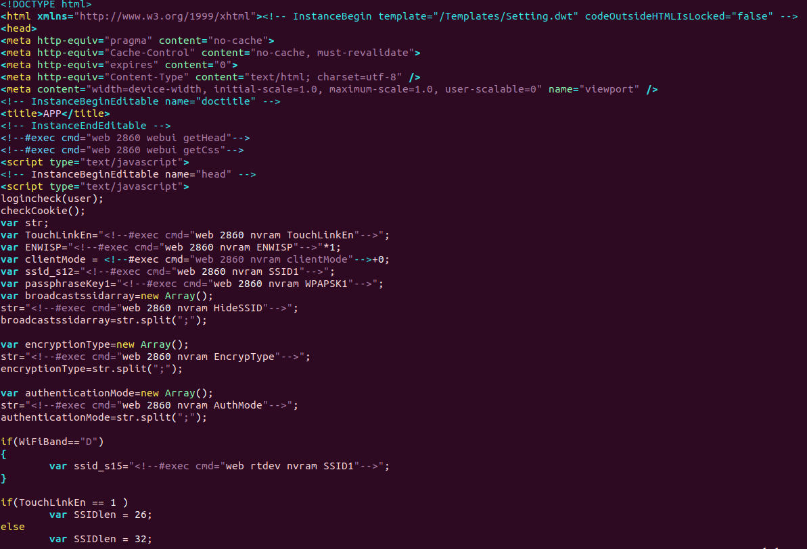
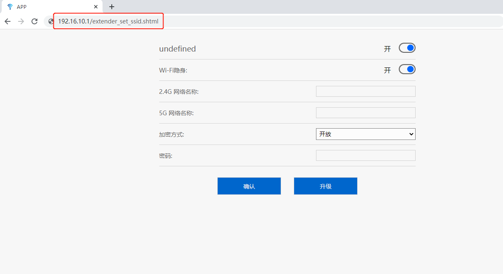

## 0x01 Vulnerability description

A vulnerability is in the 'extender_set_ssid.shtml' page of the WAVLINK WN579 X3,Firmware package version M79X3.V5030.201201

Unauthorized users can obtain the key information of the router by visiting:

```
http://xxx.xxx.xxx.xxx/extender_set_ssid.shtml
```

## 0x02 Affected version

```
WAVLINK WN579 X3
```

## 0x03 Vulnerability

The interface can be accessed without authorization, and can operate WiFi at the same time.



## 0x04 PoC verification



## 0x05 Acknowledgement

PeiWen.Huang
